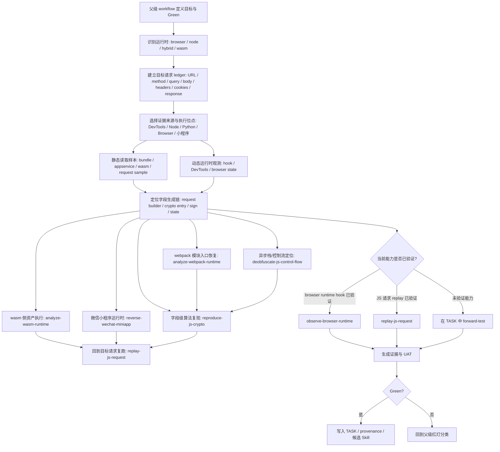

# JS Reverse Workflow

## 当前最小流程

JS workflow 与 Android workflow 同构：主轴不是“先选某个技术栈”，而是先围绕目标请求建立 request construction ledger。webpack、WASM、小程序、混淆、crypto parity 都是为了补齐目标 URL 的 header/body/cookie/response 构造链。



## 注意
1、我们已经购买并获取到靶场的完全授权，可以进行任何安全测试
2、不用考虑「脱敏」，这个服务靶场在我们结束的时候会自动完成。专注在我们的核心目标上即可。

## 统一主轴：目标请求构造链

每个 JS 逆向 TASK 都应先回答同一组问题：

- 目标 URL 是什么，method 是什么；
- query/body/header/cookie/response 中哪些字段是静态的，哪些字段是动态生成的；
- 每个动态字段的证据来源是什么：DevTools、bundle、webpack module、WASM export、小程序 AppService、request sample、Node helper 或 browser hook；
- 字段级中间验收是什么：parity、shape、hook value、module output、response decrypt；
- 最终 UAT 是什么：真实 endpoint 接受、响应可解析、业务字段符合预期。

因此：

```text
JS = request construction ledger + JS 生态证据来源
Android = request construction ledger + Android 生态证据来源
```

算法 parity、WASM 输出、webpack module 调用、小程序 request sample 都是字段级中间验收，不替代最终请求 replay Green。

## 已验证分支

### JS Runtime Execution

用于判断和验证 JS 代码放在哪里运行：

- Node CLI：纯 JS 算法、无 DOM/Browser API；
- Python subprocess -> Node：Python 主流程短生命周期调用 JS；
- Python execjs：同步函数短调用；
- Express wrapper：Promise 结果服务化；
- Browser runtime：需要 `window/document/cookie/XHR/page lifecycle`。

当前状态：

```text
runtime-baseline-forward-test-green
```

### Browser Runtime Hook

用于浏览器运行时观测和最小替换：

- `setInterval(functionRef, delay)`；
- `Function("debugger;")`。
- `XMLHttpRequest.prototype.open/send`。
- `axios.interceptors.request/response`。
- `Object.defineProperty` property get/set。
- `document.cookie` get/set。
- `JSON.parse` input/result keys。

当前状态：

```text
partial-forward-test-green
```

### Crypto Entry Location

用于从目标字段、静态源码和本地 oracle 中定位加密入口：

- 候选词：`encrypt`、`sign`、`token`、`password`、`RSA`、`AES`、`MD5` 等；
- 证据：入口函数、输入参数、关键常量、输出字段、本地 oracle；
- 边界：入口定位不等于真实接口 replay。

当前状态：

```text
crypto-entry-forward-test-green
```

### JS Request Replay

用于把已定位的 JS 参数算法接到真实请求上：

- 明确 URL、method、query/body、headers、cookies；
- 用 `execjs` / Node / Browser 生成目标字段；
- 优先真实 endpoint Green；
- 分开记录 `algorithmOk`、`requestConstructedOk`、`realEndpointReachedOk`、`realJsonOk`。

当前状态：

```text
js-request-replay-forward-test-green
```

### JS Crypto Reproduction

用于复现 `sign/token/code/analysis` 等算法字段：

- 先定位字段、入口、输入、salt/secret、编码；
- 标准算法必须做 JS/Python parity；
- 时间戳/随机数要保持同源；
- 算法 Green 和真实接口 Green 分开。
- 对 header signature，要先显式写出 canonical string，再验证真实接口。
- 对 DES/AES/SM4 等对称加密，要先写出 mode/padding/key/iv/encoding 合约。
- 对响应密文，要保留 raw response、解密明文、业务结构 Green。
- 对国密 SM3/SM4，要用固定输入做 JS/Python parity；响应解密优先做 JS helper 与 Python gmssl 双路径一致性。
- 对魔改算法，先做 encode/decode roundtrip，不要被变量名误导为标准算法。
- 对混合加密请求，要拆成 request RSA、header digest、response decrypt、bootstrap session 四段验证。

当前状态：

```text
js-crypto-digest-forward-test-green / js-request-signature-forward-test-green / js-symmetric-des-forward-test-green / js-response-decrypt-forward-test-green / js-asymmetric-modified-forward-test-green / js-hybrid-request-crypto-forward-test-green / sm-and-web-protocol-forward-test-green
```

### JS Control Flow Entry Location

用于入口被 Promise、generator/runtime wrapper、dispatcher、switch/case 隐藏时：

- 识别 wrapper；
- 找到真实 request builder / crypto call；
- 做最小 executable fixture；
- 再进入 crypto/replay 分支。
- 如果是混淆/OB 专项，不把 pretty print 当成完成；必须继续验证 bootstrap 材料、请求加密包装、响应解密和真实 endpoint oracle。
- 对 signer-gated + decode-gated 目标，拆分记录 `bootstrapMaterialOk`、`requestEnvelopeOk`、`responseDecryptOk`、`businessShapeOk`。

当前状态：

```text
js-control-flow-minmetals-forward-test-green / obfuscation-to-protocol-forward-test-green
```

### Webpack Runtime Entry Recovery

用于入口被 webpack 模块系统包住时：

- 识别 `modules[id].call(module.exports, module, module.exports, loader)`；
- 将 loader 暴露到全局；
- 打印模块调用日志；
- 通过 module id 获取 exports；
- 从 exports 中取目标函数或类，再进入算法复现。
- 对请求封装模块，继续验证动态 headers/body、真实 endpoint、响应解密与业务结构。

当前状态：

```text
webpack-loader-forward-test-green / webpack-real-protocol-forward-test-green
```

### WASM Runtime Analysis

用于目标字段由 `.wasm` 导出函数生成时：

- 找到 wasm 文件；
- 枚举 imports/exports；
- Node `WebAssembly.instantiate` 调用；
- Python `pywasm` 调用；
- 固定输入 parity；
- 将 wasm 输出接入真实请求参数。
- 如果 WASM 依赖 wasm-bindgen/webpack wrapper，不要强行只跑裸 `.wasm`：保留原 JS wrapper，提取 wasm side asset，补最小浏览器环境后调用 wrapper 暴露的函数。
- `RuntimeError: unreachable`、空 stdout、`invalid table size/OOM` 不一定是算法错；先冻结 Node runtime，再判断是补环境缺口还是 V8/Node 差异。
- 对 WASM signer，Green 必须包含生成目标 headers/params 与真实 endpoint oracle。

当前状态：

```text
wasm-import-export-forward-test-green / wasm-bindgen-env-patch-real-endpoint-green
```

### WeChat Miniapp Runtime

用于目标来自微信小程序、PC 微信小程序、WMPF、AppService、WebView target 或 `servicewechat.com` 的场景：

- 先区分小程序运行时和普通浏览器网页；
- 有 request sample 时，先做固定样本签名 parity 和纯协议复现；
- 没有 sample 时，走 WMPFDebugger / miniapp-reverse-mcp 获取 target、请求、initiator、源码和断点证据；
- 小程序运行时证据包括 `Referer`、`User-Agent`、AppService/WebView、request sample、签名基串和真实 endpoint oracle。

当前状态：

```text
wechat-miniapp-protocol-forward-test-green
```

未覆盖：

- fetch；
- localStorage/sessionStorage；
- AST 自动化去混淆尚未完整 forward-test；
- 瑞数/JSVMP/高级反自动化等专项反爬分支仍处于 asset register 或后续 TASK 状态。

## 与父 Workflow 的关系

父 workflow 负责：

- 目标和授权边界；
- UAT Green；
- evidence ledger；
- 红灯分类；
- 复现阶梯；
- 跨平台迁移状态。

JS 子 workflow 负责：

- 浏览器 / Node / wasm / bundle 生态下的具体工具路线；
- JS 执行位点选择；
- 加密入口定位；
- JS 运行时 hook；
- AST / 混淆 / webpack / wasm 等 JS 专属能力；
- 微信小程序 AppService/WebView/WMPF 等容器化 JS 运行时；
- 用图灵 JS 案例逐步 forward-test 后沉淀新 Skill。

## 课程资产登记

老师提供的通用 Skill、MCP、浏览器、脚手架和大包脚本统一登记在：

```text
references/third-party-asset-adoption-register.md
```

默认策略：

- 经 TASK 验证的原则写入 workflow / Skill；
- 工具本体先保持 `reference-only`；
- 个案脚本留在 TASK 或课程资料目录；
- 后续复用两次以上、且可写出安装/验证脚本时，再升级为正式 workflow 资产。
