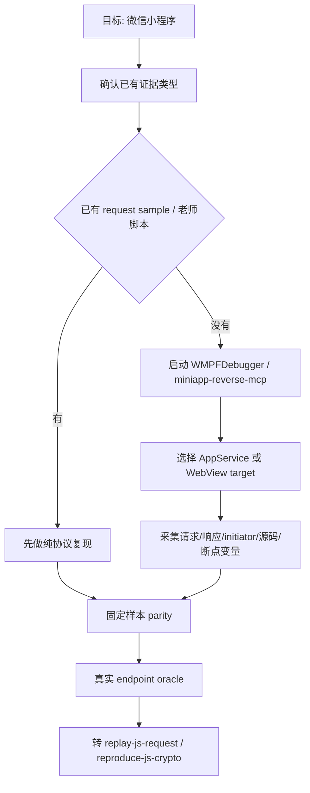

# reverse-wechat-miniapp

## 适用场景

当目标来自微信小程序、PC 微信小程序、WMPF、AppService、WebView target、`servicewechat.com`、`appservice.app.js`、小程序 request sample 或 WMPFDebugger 调试链路时，使用本 Skill。

不要把小程序默认当成普通浏览器网页。小程序可能包含：

- 逻辑层 AppService；
- 渲染层 WebView；
- 微信容器注入的 `wx.request`、storage、登录态和设备字段；
- `servicewechat.com/.../page-frame.html` referer；
- PC 微信/WMPF 特有 user-agent；
- 需要 WMPFDebugger 或 miniapp MCP 才能拿到的 target、initiator、脚本和断点证据。

## 总流程

## 证据台账

每个小程序 TASK 至少记录：

- 小程序名称和目标业务动作；
- AppService/WebView 证据来源；
- request sample 路径；
- method、url、headers、body、response 摘要；
- referer 和 user-agent 中的小程序运行时特征；
- 签名/加密字段的固定样本 parity；
- 真实 endpoint oracle；
- 是否需要 WMPFDebugger/MCP 继续动态定位。

## 有 request sample 时

优先做纯协议复现：

1. 从 sample 中抽 method/url/headers/body；
2. 找签名字段与固定样本；
3. 写出签名基串、字段顺序、编码规则；
4. 固定样本 parity；
5. 构造真实请求；
6. 只在真实接口成功后标记 replay Green。

## 无 request sample 时

转动态调试：

1. 启动或连接 WMPFDebugger；
2. 等用户打开目标小程序并触发动作；
3. 枚举 AppService/WebView target；
4. 优先按接口路径、字段名、header 名搜索；
5. 用请求 initiator 和断点拿调用栈、局部变量、签名前基串；
6. 采集完成后转纯协议复现。

## 常见红灯

| 红灯 | 现象 | 处理 |
| --- | --- | --- |
| target 不明确 | 多个 AppService/WebView | 先确认目标，不随机切换 |
| 只有请求没有入口 | 能抓包但不知道参数来源 | 查 initiator，再读 appservice 上下文 |
| 签名样本不匹配 | 固定抓包样本算不出签名 | 检查字段顺序、URL encode、空白压缩、登录态字段 |
| 真实接口失败 | parity 过了但 endpoint 不过 | 对比小程序 UA、Referer、Authorization、时间戳、body 序列化 |
| 依赖微信容器 | Node/Python 缺 `wx` 或容器字段 | 先抽 request sample，再补最小运行时或继续动态断点 |

## 课程来源

具体课程证据记录在：

`../../references/course-provenance.md`
