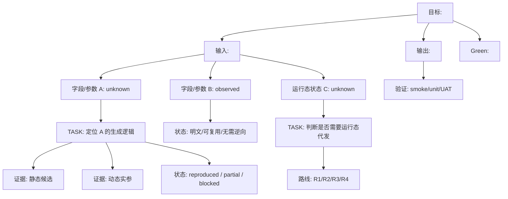

# Mermaid Evidence Tree Template

用于把目标请求、函数或行为拆成“待解节点树”。节点以目标对象为根，不以工具步骤为根。

## 节点标签建议

- `unknown`: 还没有解释；
- `observed`: 已观测到值，但未解释生成逻辑；
- `explained`: 已解释来源；
- `reproduced`: 已能外部或运行态复现；
- `waived`: 明确不需要逆向，例如明文字段或业务无关字段；
- `blocked`: 当前路线阻塞，需要换路或等待环境；
- `forward-test-pending`: 当前案例可解释，但未迁移验证。

## 使用规则

1. 根节点写目标，不写工具。
2. 第一层优先拆输入、输出、Green。
3. 子节点围绕待解字段、运行态状态、环境依赖或红灯展开。
4. 工具步骤只作为某个待解节点的证据路径，不成为主轴。
5. 每个 `TASK` 节点应能链接到对应任务文档。
6. 图中允许同时存在多条平行路线，但要标注主路线、备选路线和验证状态。

