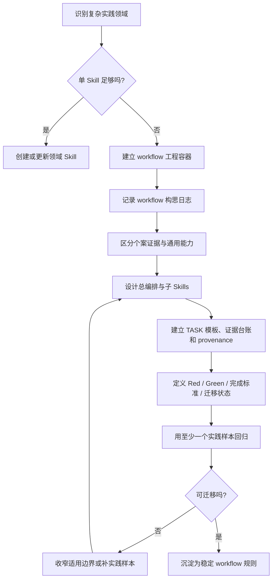

# Workflow Tao 总流程

## 总体流程



## 核心判断

一个领域需要 workflow，而不只是 Skill，通常因为它出现了以下信号：

- 需要一个总编排来路由多个子能力；
- 同一任务有多条路线、分支、红灯和回退策略；
- 需要保留个案 TASK 与通用能力之间的证据边界；
- 需要保留 workflow 构思、讨论、分歧和抽象过程，避免只留下最终规则；
- 需要模板、台账、状态机、测试和迁移评测；
- 正向构造与逆向审计共享同一质量标准；
- 一个成熟 workflow 需要抽父以容纳多个平台或子领域。

## 载体约定

Codex 识别的是 `SKILL.md`，不天然识别自定义 workflow 概念。因此这里的 workflow 不是另一套文件格式，而是一类特殊的复合 Skill：

```text
workflow = 以 Skill 为可调用载体的能力工程系统
```

注意：父子编排原则并不只适用于目录名为 `workflow-xxxx` 的能力工程。一个普通命名的复合 Skill 只要出现“父 Skill 提供通用抽象与路由、子 Skill 承接专用执行”的结构，也应采用同一套分层原则。差别只在规模和命名：

```text
workflow 型 Skill = 大型能力工程，通常放在 workflows/workflow-xxxx/
复合 Skill = 中小型父子 Skill，通常仍可放在 skills/xxxx/，但内部也可以有 skills/
```

二者共同原则：

```text
父入口 SKILL.md 负责目标、抽象协议、路由和完成标准；
子 skills/ 负责具体场景、文本类型、平台或输出形态的执行；
reference/template/test 负责稳定规则、模板和回归。
```

若同一主轴存在不同执行深度，父入口 `SKILL.md` 必须在头部声明执行模式，例如：

```text
mode: diagnose-only / full-execution
mode: internal-blind-audit / full-evidence-audit
```

每个 mode 都要写清：

```text
适用场景；
哪些步骤必须执行；
哪些步骤只产出 pending / request / plan；
哪些外部工具或检索允许调用；
完成标准和禁止事项。
```

不要让 subAgent 通过猜测判断“这一步是列请求即可，还是必须真的执行完”。同一 workflow 的主轴可以共享，但不同 mode 的 Green 标准必须分开写清。

设计父入口与子 Skills 时，应先判断复合 Skill 的主要复杂性来自哪里。常见有两类：

```text
工序型复合 Skill：按稳定工作步骤拆子 Skill；
诊断路由型复合 Skill：父 Skill 管主轴，子 Skill 承接被路由出来的专门验法 / 知识域。
混合型 workflow：顶层按路线 / 红灯 / 环境状态分诊，子路线内部按工序推进。
```

详细判断见 `references/composite-skill-patterns.md`。

工程约定：

```text
目录名：workflow-xxxx
入口文件：SKILL.md
内部结构：orchestrator + references + templates/assets + subworkflows + projects/TASK + tests/provenance
```

workflow 创建或重大升级时，建议包含：

```text
logs/
└── YYYY-MM-DD-主题.md
```

`logs/` 保存 workflow 构思过程、关键讨论、分歧、原文摘录、抽象路径和迁移边界。稳定规则通过复核后再提升到 `references/`、`templates/` 或父入口 `SKILL.md`。详细规则见 `references/workflow-conception-log-policy.md`。

若能力只是复合 Skill 而非 workflow 型 Skill，可保留普通目录名，但仍建议：

```text
skill-name/
├── SKILL.md
├── skills/
│   ├── child-skill-a/
│   │   └── SKILL.md
│   └── child-skill-b/
│       └── SKILL.md
├── references/
├── assets/ 或 templates/
└── tests/
```

需要创建或重构 workflow 型 Skill 时，先读取 `references/workflow-skill-shape.md`。

## 分层原则

```text
workflow = 以 Skill 为载体的能力工程系统
skill = 可调用执行单元
composite skill = 带父入口、路由和内部子 skills 的复合可调用能力
subworkflow = 平台或子领域专属 workflow
project / TASK = 个案过程、证据、日志、失败和人工关口
workflow logs = workflow 构思过程、讨论原文、抽象决策和未稳定规则
reference = 稳定方法、边界、路线选择和判断标准
template = 可复用文档、台账和项目骨架
provenance = 能力来源、清洗方式和迁移状态
```

## 实践驱动抽象

不要先把元规则写死。每条元规则至少应说明来自哪类实践：

- 成熟 workflow 抽父；
- 课程/案例驱动；
- 真实项目反哺；
- 技术 Radar 反哺；
- 正向构造 / 逆向审计对称分析。
- 回归测试实践反哺：一次有效的 regression run 若沉淀出可迁移的测试组织、分支保护或污染检查规则，应先留在 run / comparison / log，再提升到 reference。
- 执行模式反哺：若真实任务暴露出“同一步骤在盲跑、初审、正式执行或完整检索中完成标准不同”，应先在 TASK 记录，再提升为 mode-aware completion standard。
- Workflow 构思过程反哺：当一次对话、项目复盘或抽父过程产生新的 workflow 设计，应先写入目标 workflow 的 `logs/YYYY-MM-DD-主题.md`，记录原始问题、关键原文、方案分歧、最终决定和迁移边界；只有稳定、可迁移的部分再提升到 `references/` / `templates/` / `SKILL.md`。

## 内部参考

- `references/workflow-skill-shape.md`：workflow 型 Skill 应该长什么样。
- `references/composite-skill-patterns.md`：复合 Skill 的常见类型，包括工序型与诊断路由型。
- `references/reference-workflow-cases.md`：可参考的成熟和发展中 workflow 样本索引。
- `references/workflow-placement-policy.md`：复杂能力应放在 workflow、Skill、TASK 还是 reference。
- `references/regression-test-protocol.md`：Skill / workflow 修改后的回归测试协议，包含纯净 subAgent 与 baseline/target 质量对比。
- `references/workflow-conception-log-policy.md`：workflow 构思日志机制，规定 `logs/YYYY-MM-DD-主题.md` 的触发、内容和提升边界。
- `skills/workflow-tao-orchestrator/SKILL.md`：创建、抽父、迁移和回收 workflow 型 Skill 的总编排。
