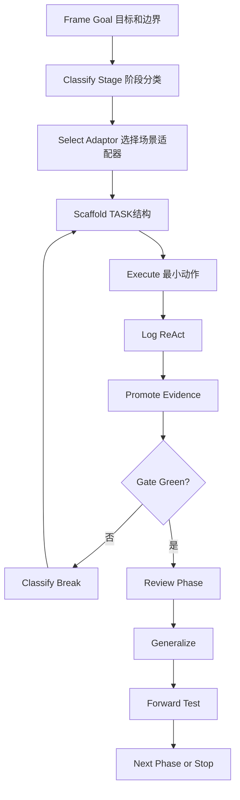

# Core Loop

## 核心循环



## Frame

明确：

- 原始困惑；
- 当前目标；
- 当前阶段目标，而不是最终幻想目标；
- 不做什么；
- 授权边界；
- 交付物；
- 完成标准。

## Classify Stage

判断当前目标属于：

- opportunity-evaluation；
- execution-delivery；
- phase-review；
- capability-generalization。

阶段不同，Green 标准不同。不要用执行阶段的交付标准要求机会评估阶段，也不要把机会评估阶段的“可接”误写成项目已成功。

## Select Adaptor

根据项目类型选择 adaptor：

- 外包/客户需求：`outsourcing-project-adaptor`；
- 学术研究：预留 `academic-research-adaptor`；
- 论文写作/审稿：预留 `manuscript-project-adaptor`；
- 软件工具：预留 `software-tool-adaptor`；
- 其他：通用 task-driven 结构。

## Scaffold

创建或更新：

- README；
- TASK 总说明；
- TASKxx；
- logs；
- outputs；
- tests/UAT；
- Makefile/venv/dashboard。

机会评估阶段可以轻量 scaffold，不必一开始就创建完整开发项目。

## Execute

每次只推进一个可验证动作。长跑任务必须有 checkpoint/resume。

## Log

重要动作写入 ReAct：

```text
Thought / Action / Observation / Reflection
```

## Promote Evidence

把关键终端输出、raw JSON、SQLite 状态、截图判断提升成 Markdown 证据摘要，并链接到 raw 路径。

## Gate

每个阶段必须有 gate：

```text
机会评估：接 / 不接 / 先 PoC / 改范围 / 等客户材料。
执行交付：通过 / 未通过 / 需返工 / 需变更范围。
复盘沉淀：仅个案保留 / 可迁移 / 需要更多样本。
```

## Review Phase

阶段完成后写：

```text
final_outputs/*复盘.md
```

内容包括：

- 原问题如何变化；
- Red -> Green；
- 证据地图；
- 覆盖率边界；
- 工程坑；
- 反哺候选。

## Generalize

判断经验应该进入：

- 当前 TASK docs；
- 项目 docs；
- final_outputs；
- workflow references；
- skill；
- template。

## Forward Test

通用规则至少需要一个实践样本支撑；迁移到新项目后再标记更高稳定性。
