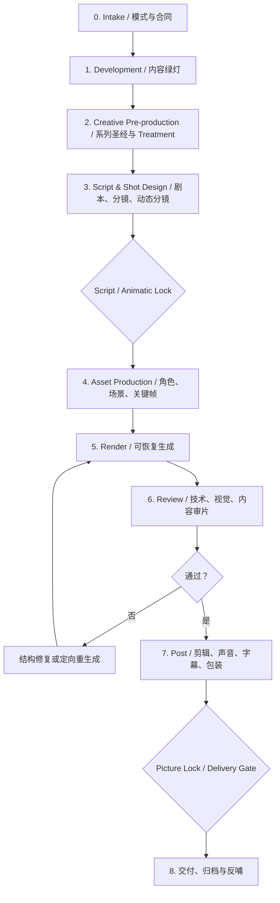

# Video Workflow

状态：`0.1-seed / structural-green / forward-test-pending`

拓扑：`tree-like mainline + gated rework loops`

## 目标

把视频生产从“逐次提示词调用”升级为一条文档驱动、资产可寻址、任务可恢复、审片有证据、规则可演化的生产线：

```text
内容意图
-> 可执行创意
-> 可审镜头
-> 可复用资产
-> 可恢复生成
-> 独立审片与返修
-> 可交付母版
-> 项目证据反哺 workflow
```

本 workflow 管的是跨阶段协议和 Gate，不替代项目管理，也不绑定某一家图像、视频或托管平台。

## 当前边界

当前只有一个完整来源案例和一个待执行的前向样本。因此：

- 可作为视频项目的结构化入口和路由器；
- 可使用当前模板建立项目合同、产物台账和 Gate；
- 不得把当前火柴人微课、Agnes、阿里云或某种提示词写法宣称为通用最佳实践；
- 不得在没有项目授权和样片 Gate 的情况下批量调用付费或有额度的外部服务；
- 新子 Skill、subworkflow、脚本和平台 adapter 只在真实执行暴露稳定边界后补建。

来源与迁移状态见 [`provenance/source-registry.md`](provenance/source-registry.md)。

## 调用入口

复杂项目默认调用 [`skills/workflow-video-orchestrator`](skills/workflow-video-orchestrator/SKILL.md)。

开始前：

1. 读取 [`references/core-loop.md`](references/core-loop.md)；
2. 根据任务读取 [`references/routing.md`](references/routing.md)；
3. 若项目还没有等价合同，复制 [`templates/video-project-contract.md`](templates/video-project-contract.md) 到项目内并填写；
4. 若项目已有 README、Roadmap、TASK 或 manifest，复用其单一事实源，不在 workflow 目录复制项目材料。

## 四种执行模式

| 模式 | 适用 | 允许的动作 | 完成标准 |
|---|---|---|---|
| `design-only` | 方案、剧本、系列圣经、分镜或流程设计 | 只读分析与项目内文档产出；外部生成保持 pending | 合同、阶段、产物、Gate、风险和下一动作明确 |
| `pilot-execution` | 新风格、新模型、新系列或新生产链首测 | 只运行预先约定的小样、少量镜头或样片集 | 样片、任务回执、审片记录、返修原因和是否放量的决定齐全 |
| `batch-execution` | 样片 Gate 已通过的批量生产 | 按 manifest 断点续跑、限流、重试、下载和 QC | 目标清单逐项进入 completed / rejected / blocked-with-reason，不能静默丢项 |
| `review-only` | 审片、QC、交付审计或复盘 | 不新增生成任务；只检查现有产物和证据 | 技术、视觉、内容、连续性与交付结论分层记录 |

模式必须写入项目合同或本轮任务说明。模式变化属于 Gate 决策，不能悄悄发生。

## 主流程



各阶段的必备问题、状态和产物由 [`references/core-loop.md`](references/core-loop.md) 统一定义。

## 阶段门

至少区分以下锁定点：

1. `content-greenlight`：受众、学习/传播目标、内容边界和项目价值已确认；
2. `script-lock`：叙事与知识主张可进入镜头设计，重大改写需重新开 Gate；
3. `animatic-lock`：镜头顺序、节奏、时长和生成路线足以进入资产生产；
4. `pilot-production-greenlight`：样片证明质量、成本、周期和返修路径可接受，才允许放量；
5. `picture-lock`：画面结构不再改变，声音、字幕和母版可以稳定收尾；
6. `delivery-accepted`：内容、技术、版权/来源、命名、版本和交付清单均通过。

短小、低风险的单支视频可以合并 Gate，但必须记录合并理由，不能直接省略风险检查。

## 核心产物

项目可以使用自己的目录和文件名，但至少要有这些语义角色：

- 项目合同：范围、模式、受众、规格、权限、预算/额度边界；
- 内容事实源：brief、教材/资料、episode registry 或 script source；
- 创意事实源：series/visual bible、Treatment、角色与连续性规则；
- 镜头事实源：shot manifest，包含旁白、构图、动作、时长、引用资产和生成路线；
- 资产索引：逻辑别名、版本、本地路径、远程地址、来源和采用状态；
- 任务台账：外部 job id、尝试次数、状态、时间、错误、成本和本地产物；
- 审片台账：技术、视觉、内容、连续性问题及修复闭环；
- 交付清单：母版、干净版、字幕、音频、封面、报告和版本哈希；
- 演化提案：哪些只是个案经验，哪些值得提升为 workflow 规则。

任何信息只能有一个语义 owner；其他文件应引用它，不能维护互相冲突的副本。

## 路由原则

详细路线见 [`references/routing.md`](references/routing.md)。父层只保持以下稳定判断：

- 知识准确性、叙事设计和画面生产是不同问题，必须分层验收；
- 中文、公式、时间轴、流程图和数据图优先使用确定性后期，不强迫生成模型直接绘制；
- 角色一致性优先由已冻结参考资产和镜头级关键帧控制，不把全部责任交给动作提示词；
- 高歧义构图反复失败时，先修关键帧或镜头结构，再考虑继续换提示词；
- 外部模型、存储/CDN、配音、剪辑和 QC 都是 adapter；只有其输入输出、状态机或恢复逻辑形成稳定边界时，才拆成子 Skill/subworkflow；
- 项目若已由 `task-driven-project-manager` 或 Roadmap 管理，本 workflow 映射到既有 TASK，不另建一套项目治理。

## 审片与返修

技术可播放不等于画面合格。至少分别检查：

- technical：编码、分辨率、帧率、时长、音轨、文件完整性；
- visual：角色/场景一致性、畸变、意外文字、风格漂移、动作和构图；
- content：事实、逻辑、隐喻、旁白与画面是否一致；
- continuity：跨镜头、跨集的角色、道具、空间、色彩与叙事连续性；
- delivery：字幕、音频、片头尾、命名、版本、来源/授权和平台规格。

审片应由独立 reviewer 角色或人工 Gate 承担。若当前条件不允许独立审片，状态写为 `awaiting-independent-review`，不能由生产者直接宣布最终通过。

## 增量演化规则

“用到什么补什么”按以下门槛执行：

```text
项目新需求或失败
-> 留在项目/TASK 形成证据
-> 判断是否重复出现且跨案例可迁移
-> 形成 change proposal
-> 人工批准后更新 reference/template/SKILL
-> forward test
-> 再决定是否拆 child Skill / adapter / subworkflow
```

只有满足下列条件才新增子能力：

- 有独立、稳定的输入输出合同；
- 有自己的 Red/Green、恢复或审片逻辑；
- 能在不读取当前项目私有上下文时复用；
- 至少有前向测试计划，且不会把单一案例伪装成通用规律。

## 完成与停止

本 workflow 的完成不是“生成了一个 MP4”，而是本轮模式的产物、状态和 Gate 都闭合。

必须停止并请求方向的情况：

- 需要新增预算、账号、密钥、公开发布或其他未授权外部状态；
- 内容取舍、品牌风格或角色设定存在会改变整个系列的重大分歧；
- 样片未过 Gate 却要求批量放量；
- 来源、版权、隐私或事实风险无法在现有范围内消除；
- 需要用个案证据改写 workflow 稳定规则，但尚未获得人工批准。

## 当前前向测试

当前登记的 forward test 是“16 集火柴人微课”的 CH01 双集，详情见：

- [`projects/CASE-260715-16集火柴人微课.md`](projects/CASE-260715-16集火柴人微课.md)
- [`tests/forward-test-plan.md`](tests/forward-test-plan.md)

在该测试完成前，本 workflow 保持 `structural-green / forward-test-pending`。
